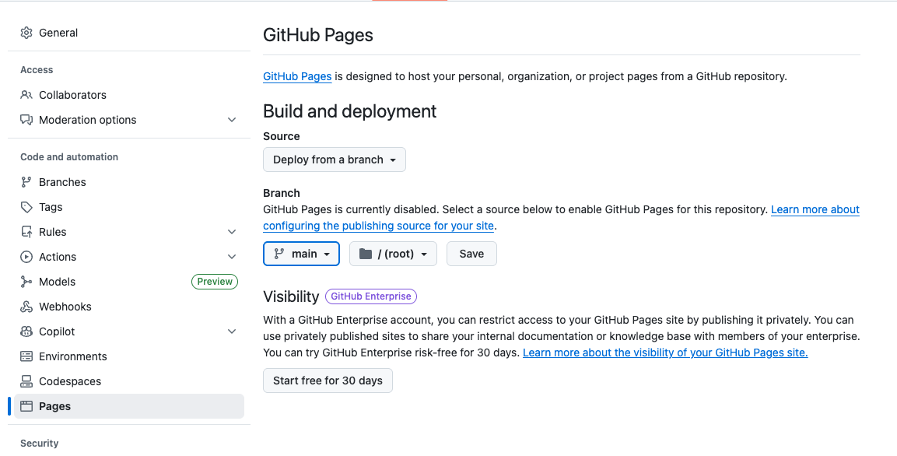

# Deploying a simple HTML page to GitHub Pages

Useful resources:

- [Quickstart](https://docs.github.com/en/pages/quickstart)
- [GitHub Pages Documentation](https://docs.github.com/en/pages)

The most important steps are described below.

## 1. Create a GitHub repository

First, create a new git repository on GitHub. You can do this by going to your GitHub account and clicking on the "New" button in the repositories section.

You should have done this already quite a few times now.

Make sure the repo is public. Name does not matter.

No template, no README, no .gitignore, no license needed. Let's keep it simple.

## 2. Clone the repository

Follow the instruction on GitHub to clone the repository to your local machine.

## 3. Add your HTML files

Add a very simple `index.html` file to the root of your cloned repository. You can use the template below. Of course you can also add css, javascript and other assets as needed. But we will keep it simple for this demo.

```html
<!DOCTYPE html>
<html lang="en">

<head>
  <meta charset="UTF-8">
  <meta name="viewport" content="width=device-width, initial-scale=1.0">
  <title>Hello</title>
</head>

<body>
  <h1>👋 Hello from GitHub Pages!</h1>
  <p>This is a demo page deployed using GitHub Pages! 👊</p>
</body>

</html>
```

## 4. Commit and push your changes

After adding your HTML file, commit and push your changes to the GitHub repository.

Publish your your branch to GitHub:

## 5. Enable GitHub Pages

Go to settings of your repository on GitHub.

Scroll down to the "Pages".

Select the branch you want to deploy from (usually `main`) and click "Save". This will serve the content of your root directory.



That's it. It is as simple as that.

You can know visit your site at `https://<your-username>.github.io/<your-repo-name>/`.
